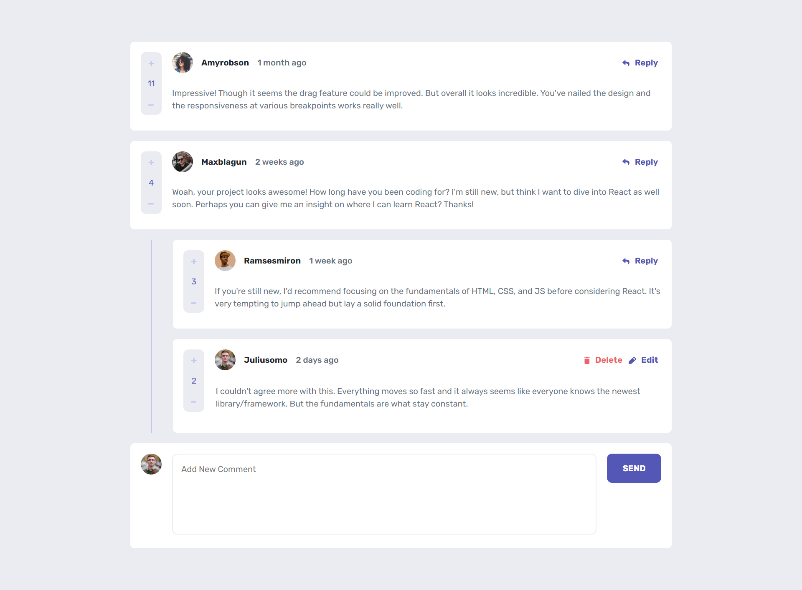
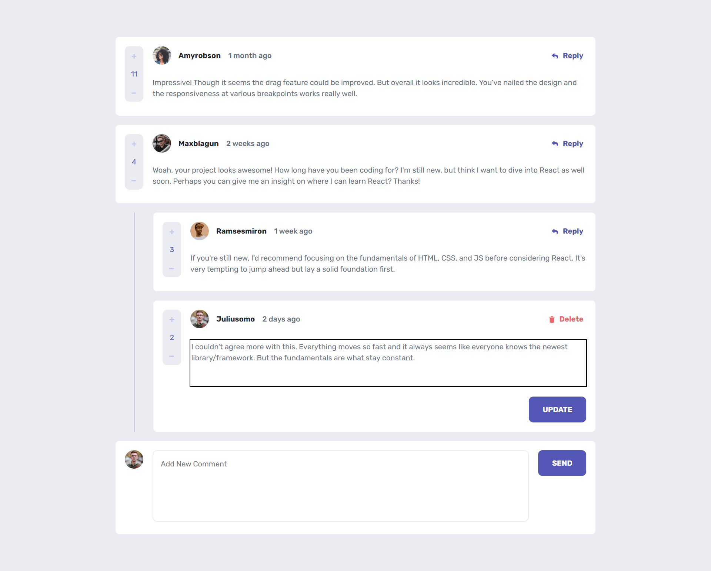

# interactiveCommentsTask

## Overview

### Links

- Solution URL: https://github.com/AbdoSadory/interactiveCommentsTask
- Live Site URL: https://interactive-comments-task.vercel.app/

### Screenshot

 
 
 

### Built with

- Semantic HTML5 markup
- [React](https://reactjs.org/) - JS library
- CSS custom properties and Grid through CSS modules
- Bootstrap.
- Redux (State Managment System)

### What I learned

- How to use Grid CSS.
- How to use Redux.

## Author

- Website - [Sadory](https://github.com/AbdoSadory)
- Frontend Mentor - [@Abdelrhman Sayed El-Sadory](https://www.frontendmentor.io/profile/AbdoSadory)
